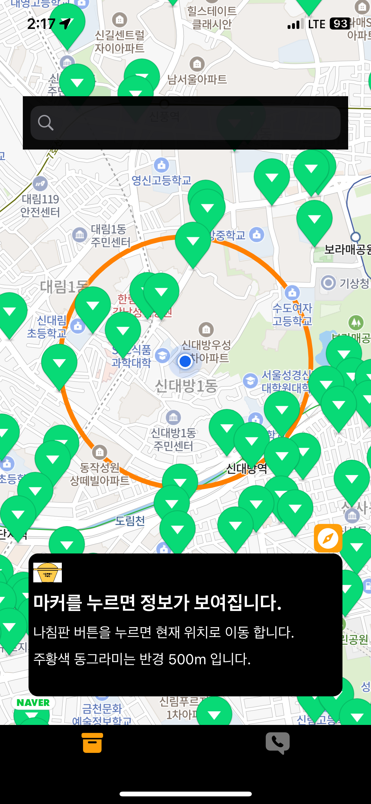

# ❄️ 제설이 (ZesulE)

> **서울시 제설함을 한눈에 찾는 가장 쉬운 방법**
<p align="center">
  
  
</p>
## 📖 프로젝트 소개

겨울철 폭설 시 **가장 가까운 제설함**을 찾기 어려우셨나요?  
제설이는 서울시 공공데이터를 활용하여 **현재 위치 기준 주변 제설함**을 지도에서 한눈에 보여주는 iOS 앱입니다.

### 💡 왜 만들었나요?
- 서울시 공공데이터는 제설함 위치를 좌표로만 제공 → 직관적으로 파악하기 어려움
- 긴급 상황에서 빠르게 제설함을 찾을 수 있는 앱의 필요성 발견
- **공공데이터 + 외부 SDK 통합 경험**을 목표로 개발

---

## ✨ 주요 기능

| 기능 | 설명 |
|------|------|
| 🗺️ **실시간 위치 기반 검색** | 현재 위치에서 가장 가까운 제설함을 지도에 표시 |
| 🔍 **주소/도로명 검색** | 특정 주소나 도로명으로 제설함 위치 검색 |
| 📍 **상세 정보 제공** | 제설함 관리 기관 및 연락처 정보 표시 |
| 🚀 **빠른 접근성** | 네이버 지도 SDK로 정확하고 직관적인 지도 UI |

---

## 🛠 Tech Stack

### **Frameworks & Languages**
- **Swift** - iOS 네이티브 개발
- **SwiftUI** - 선언형 UI 구현
- **MVVM Architecture** - 코드 구조화

### **External Libraries & SDKs**
- **Naver Maps SDK** - 지도 표시 및 마커 렌더링
- **Firebase Realtime Database** - 제설함 데이터 저장 및 관리
- **Swift Package Manager (SPM)** - 의존성 관리

### **Data Source**
- 서울시 공공데이터 포털 (제설함 위치 데이터)

---

## 🎯 기술적 도전과 해결

### 1️⃣ **좌표 체계 불일치 문제**

**문제**  
- 공공데이터: EPSG:5179 (Korean 2000) 좌표계
- Naver Maps SDK: WGS84 (위도/경도) 좌표계 필요

**해결**  
- Excel을 활용한 좌표 변환 (EPSG:5179 → WGS84)
- 변환된 데이터를 JSON 형식으로 파싱
- Firebase에 업로드하여 실시간 접근 가능하도록 구성

### 2️⃣ **데이터 저장소 선택**

**고민**  
- 네트워킹으로 매번 fetch? → 속도 느림
- 로컬 저장? → 업데이트 불편

**해결**  
- **Firebase Realtime Database** 선택
- 실시간 동기화 + 빠른 접근 속도 확보
- 향후 데이터 업데이트가 용이한 구조

---

## 🚀 Getting Started

### Requirements
- iOS 14.0+
- Xcode 13.0+
- Swift 5.0+

### Installation

1. **Clone the repository**
```bash
git clone https://github.com/simoni-git/ZesulE.git
cd ZesulE
```

2. **Install dependencies**
```bash
# SPM을 통해 자동으로 설치됩니다
```

3. **Naver Maps SDK API Key 설정**
```swift
// AppDelegate.swift 또는 설정 파일에서
NMFAuthManager.shared().clientId = "YOUR_NAVER_CLIENT_ID"
```

4. **Firebase 설정**
- Firebase Console에서 프로젝트 생성
- `GoogleService-Info.plist` 다운로드 후 프로젝트에 추가

5. **Run the project**
```bash
open ZesulE.xcodeproj
```

---

## 📂 Project Structure

```
ZesulE/
├── Models/          # 데이터 모델 (제설함 정보)
├── Views/           # SwiftUI View 컴포넌트
├── ViewModels/      # 비즈니스 로직
├── Services/        # Firebase, 네트워크 통신
└── Resources/       # Assets, 데이터 파일
```

---

## 💭 회고 (Retrospective)

### 잘한 점 ✅
- 공공데이터를 실생활에 유용한 앱으로 전환
- 좌표 변환 등 데이터 전처리 경험 축적
- Firebase를 활용한 실시간 데이터 관리 구현

### 아쉬운 점 📝
- 서울시 데이터만 지원 (타 지역 확장 필요)
- 제설함 재고 상태 실시간 반영 미구현

### 다음 프로젝트에 적용할 점 🎯
- Unit Test 추가
- 지역 확장 가능한 확장성 있는 설계

---

## 🔗 Links

- **GitHub Repository**: [simoni-git/ZesulE](https://github.com/simoni-git/ZesulE)
- **공공데이터 출처**: [서울시 열린데이터광장](https://data.seoul.go.kr/)

---

## 👤 Author

**고민수 (Minsu Go)**
- 📧 Email: gms5889@naver.com
- 💼 GitHub: [@simoni-git](https://github.com/simoni-git)
- 📝 Blog: [네이버 블로그](https://blog.naver.com/gms5889)

---

## 📄 License

This project is licensed under the MIT License - see the [LICENSE](LICENSE) file for details.
